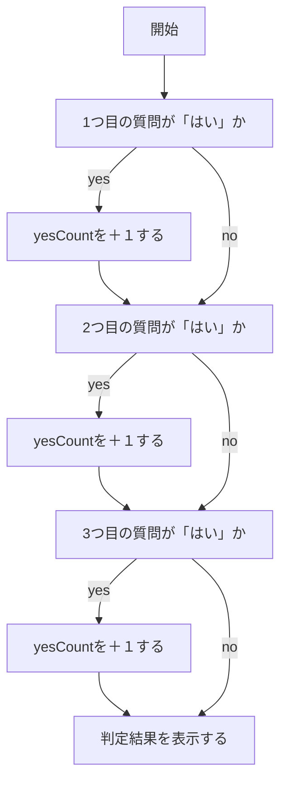

# webpro_06仕様書

制作者：野口　滉太


## 概要

app5.jsは、Node.jsを用いて構築されたサーバーで以下の5つの機能をwebページ上で実行するものである。

・「Hello World」と表示させる

・乱数を用いたおみくじの結果の表示

・指定した手とのジャンケン結果の表示

・簡単なたし算の結果の表示（追加）

・3つの質問による性格診断の結果の表示（追加）

## ファイル一覧

ファイル名 | 説明
-|-
app5.js | プログラム本体
public/question.html | 質問画面
show.ejs | 「Hello World」と表示
icon.ejs | アイコンの表示
luck.ejs | おみくじ結果を表示
janken.ejs | ジャンケン結果を表示
questions.ejs | 質問の結果を表示

## ファイルの編集（追加）点

・app5.jsにたし算のプログラミングの追加

・app5.jsに性格診断のプログラムの追加

・question.htmlの追加

・questions.ejsの追加


## 追加プログラムの仕様の説明
・たし算
URLパラメータで渡された2つの数値を受け取り、それらを足し算した結果をクライアントに返す。数字以外のものを与えると以下のコードによりエラー文が表示される。また、他の計算機能も必要に応じて容易に実装できるようになっている
```javascript
  if (isNaN(num1) || isNaN(num2)) {
    res.send("Error: num1とnum2には数字を指定してください。");
    return;
  }
```

・性格診断
htmlファイルに設定している3つの質問に対して「はい」、「いいえ」を受け取り、「はい」の数に応じてyesCountの値を増加させ、増加後のyesCountの値に応じて事前に設定していた答えが表示されるようになっている。req.queryという形を使用しているため、URLに直接「はい」または「いいえ」を書き込んでも結果を判定できるようにしている。処理される順番は以下のフローチャートのようになっている。


## 起動方法（性格診断）
1. Node.jsをインストールする
1. npm install　で必要なライブラリをインストールする
1. node app5.js でサーバーを起動する
1. Webブラウザでhttp://localhost:8080/public/question.html
にアクセスする
1. 表示される3つの質問の「はい」または「いいえ」にチェックを入れる
1. 「結果を見る」をクリックする


## 起動方法（たし算）
1. Node.jsをインストールする
1. npm install　で必要なライブラリをインストールする
1. node app5.js でサーバーを起動する
1. http://localhost:8080/add?num1=5&num2=10
上記リンクのnum1=とnum2=の部分に任意の数字を入れる
1. 任意の数字を入れたリンクでwebブラウザにアクセスする
1. ２つの数字を足した結果が表示される
